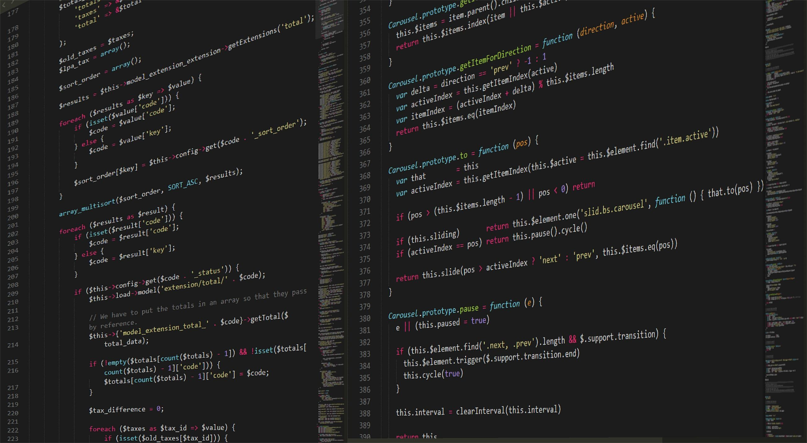
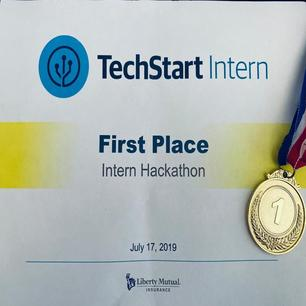
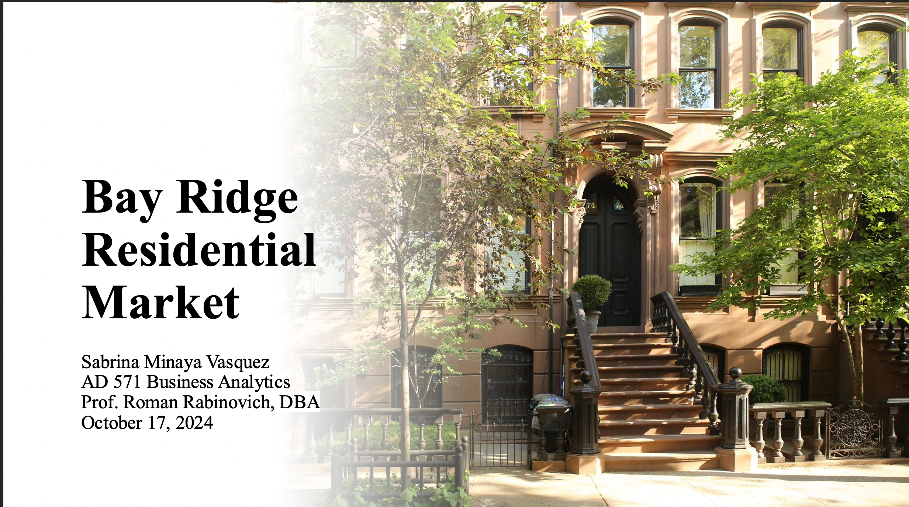

```{ =html}
<!--Loader-->
<div class="loader">
  <div class="inner"></div>
</div>

<!--Slides-->
<div id="slides">
  <div class="overlay"></div>
  <div class="slides-container">
    
    
    
  </div>

  <div class="titleMessage">
    <div class="heading">
      <p class="main">SABRINA MINAYA</p>
      <p class="sub typed"></p>
    </div>
  </div>

  <nav class="slides-navigation">
    <a href="#" class="next"></a>
    <a href="#" class="prev"></a>
  </nav>
</div>

<!--Nav-->
<nav id="navigation" class="navbar navbar-expand-lg justify-content-center">
  <a class="navbar-brand" href="#">Sabrina Minaya</a>
  <button class="navbar-toggler" type="button" data-toggle="collapse" data-target="#navbarNav"
    aria-controls="navbarNav" aria-expanded="false" aria-label="Toggle navigation">
    <span class="navbar-toggler-icon"></span>
  </button>

  <div class="collapse navbar-collapse" id="navbarNav">
    <ul class="navbar-nav ml-auto">
      <li class="nav-item active"><a class="nav-link" href="#slides">Home</a></li>
      <li class="nav-item active"><a class="nav-link" href="#about">About</a></li>
      <li class="nav-item"><a class="nav-link" href="#skills">Skills</a></li>
      <li class="nav-item"><a class="nav-link" href="#portafolio">Projects</a></li>
      <li class="nav-item"><a class="nav-link" href="#contact-info">Contact</a></li>
    </ul>
  </div>
</nav>

<!--About section-->
<div id="about" class="section">
  <div class="container">
    <div class="row">
      <div class="col-md-5">
        
        <div class="resume">
            <a href="images/Sabrina-Minaya-resume.pdf" download="CV" target="_blank">
              <button class="btn">Download Resume</button>
             </a>
        </div>
      </div>

      <div class="col-md-7">
        <h3>WHO AM I?</h3>
        <p>Sabrina Minaya earned a Bachelor's degree in Computer Science at Boston University. She grew up with her father who is obsessed with computers and their innovation. At the age of 19, Sabrina's father showed her how he was developing a sales program for a liquor store. She was fascinated by how he created a program that can search items, do the inventory of any item, calculate the total amount sold by the store, etc. The fact that Sabrina's father created something so amazing inspired her to go into technology.</p>
        <p>She's currently pursuing a Master's degree in Applied Business Analytics. Sabrina is gaining a number of skills through the program, such as statistical analysis, data mining, machine learning, data visualization, and quantitative and qualitative decision-making.</p>
      </div>
    </div>
  </div>
</div>

<!--Skill section-->
<div id="skills" class="skillsSection section">
  <div class="container">
    <div class="row">
      <div class="col-md-12 text-center">
        <h2>TECHNICAL SKILLS</h2>
        <p>A representation of my proficiency in each skill.</p>
      </div>

      <div class="owl-carousel owl-theme">
        <div class="skill">
          <span class="chart" data-percent="90"><span class="percent">90</span><canvas height="152" width="152"></canvas></span>
          <h4>Html</h4>
        </div>
        <div class="skill">
          <span class="chart" data-percent="90"><span class="percent">90</span><canvas height="152" width="152"></canvas></span>
          <h4>CSS</h4>
        </div>
        <div class="skill">
          <span class="chart" data-percent="30"><span class="percent">30</span><canvas height="70" width="152"></canvas></span>
          <h4>JavaScript</h4>
        </div>
        <div class="skill">
          <span class="chart" data-percent="70"><span class="percent">70</span><canvas height="50" width="152"></canvas></span>
          <h4>Python</h4>
        </div>
        <div class="skill">
          <span class="chart" data-percent="40"><span class="percent">70</span><canvas height="50" width="152"></canvas></span>
          <h4>SQL</h4>
        </div>
        <div class="skill">
          <span class="chart" data-percent="60"><span class="percent">70</span><canvas height="50" width="152"></canvas></span>
          <h4>C#</h4>
        </div>
      </div>
    </div>
  </div>
</div>

<!--Portafolio section-->
<div id="portafolio" class="section">
  <div class="container">
    <div class="row">
      <div class="heading"><h3>PORTAFOLIO</h3></div>

      <div class="filter">
        <ul id="filters">
          <li><a href="#" data-filter="*" class="current">ALL</a></li>
          <li><a href="#" data-filter=".apps">REPORTS</a></li>
          <li><a href="#" data-filter=".me">ME</a></li>
        </ul>
      </div>

      <div class="itemsContainer">
        <ul class="items">

          <li class="me col-xs-6 col-sm-4 col-md-3 col-lg-3">
            <div class="item">
              
              <div class="icons">
                <a href="images/Portafolio/hack-b.png" class="openButton" data-fancybox
                   data-caption="Selected as 1 of 50 out of a competitive pool of ~150 candidates within Greater Boston. Through the program, I interned at Liberty Mutual as a Software Engineer Intern">
                  <i class="fa fa-search"></i>
                </a>
                <a href="" target="_blank" class="projectLink"><i class="fa fa-link"></i></a>
              </div>
              <div class="imageOverlay"></div>
            </div>
          </li>

          <li class="me col-xs-6 col-sm-4 col-md-3 col-lg-3">
            <div class="item">
              
              <div class="icons">
                <a href="images/Portafolio/liberty-b.jpeg" class="openButton" data-fancybox
                   data-caption="Tech Start Intern Hackathon at Liberty Mutual Insurance: First place winner for creating a camera app that recognizes the value and the description of any item through Google Vision API">
                  <i class="fa fa-search"></i>
                </a>
                <a href="" target="_blank" class="projectLink"><i class="fa fa-link"></i></a>
              </div>
              <div class="imageOverlay"></div>
            </div>
          </li>

          <li class="apps col-xs-6 col-sm-4 col-md-3 col-lg-3">
            <div class="item">
              
              <div class="icons">
                <a href="images/Portafolio/Happiness report.pdf" class="openButton" data-fancybox
                   data-caption="The World Happiness Report analyzes factors influencing happiness.">
                  <i class="fa fa-search"></i>
                </a>
                <a href="images/Portafolio/Happiness report.pdf" target="_blank" class="projectLink"><i class="fa fa-link"></i></a>
              </div>
              <div class="imageOverlay"></div>
            </div>
          </li>
         <li class="apps col-xs-6 col-sm-4 col-md-3 col-lg-3">
            <div class="item">
              
              <div class="icons">
                <a href="images/sminaya-real-estate.pdf" class="openButton" data-fancybox
                   data-caption="A real estate brokerage firm is opening in the Bay Ridge, Brooklyn market. As the Business Analytics professional for our real estate brokerage firm, I've conducted an extensive analysis of residential properties and sales in Bay Ridge. The goal is to determine if opening a new real estate office in this neighborhood is an ideal and profitable investment.
                                                                       .">
                  <i class="fa fa-search"></i>
                </a>
                <a href="images/sminaya-real-estate.pdf" target="_blank" class="projectLink"><i class="fa fa-link"></i></a>
              </div>
              <div class="imageOverlay"></div>
            </div>
          </li>
        </ul>
      </div>
    </div>
  </div>
</div>

<!--Contact me section-->
<div id="contact-info" class="contact">
  <div class="container">
    <div class="row">
      <div class="col-md-12 text-center">
        <h2 class="contact-header">CONTACT ME</h2>
        <h5>I'll love to hear from you!</h5>
      </div>

      <div class="col-md-4">
        <div class="card">
          <a href="mailto:sabrinaminaya12@gmail.com"><i class="card-icon far fa-envelope"></i></a>
          <h5 class="card-tittle">Email</h5>
        </div>
      </div>

      <div class="col-md-4">
        <div class="card">
          <a href="https://www.linkedin.com/in/sabrina-minaya-03877217a/"><i class="card-icon fab fa-linkedin-in"></i></a>
          <h5 class="card-tittle">Linkedin</h5>
        </div>
      </div>

      <div class="col-md-4">
        <div class="card">
          <a href="https://github.com/Sabrina1211"><i class="card-icon fab fa-github"></i></a>
          <h5 class="card-tittle">Github</h5>
        </div>
      </div>
    </div>
  </div>
</div>

<!--Copyright-->
<div class="copyrightSection">
  <div class="col-md-12 text-center">
    <p>&copy; Copyright Sabrina Minaya 2025</p>
  </div>
</div>

```
